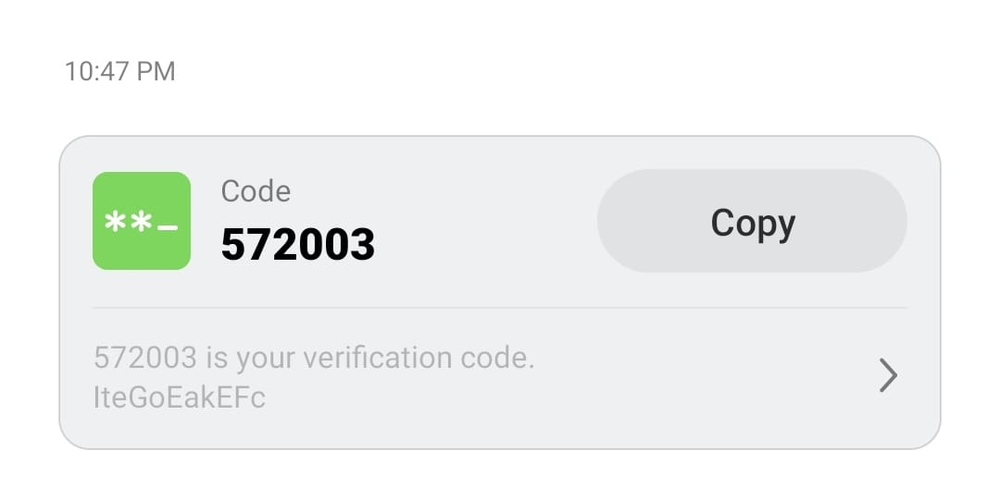

# OTP Auth

This project provides OTP Authentication for Android applications.

Tools Reqired by project:
1. Android Studio
2. JAVA
3. XML
4. Firebase

Curently my app contains: 

A splash screen

Login Activity

OTP Authentication

Main Activity

